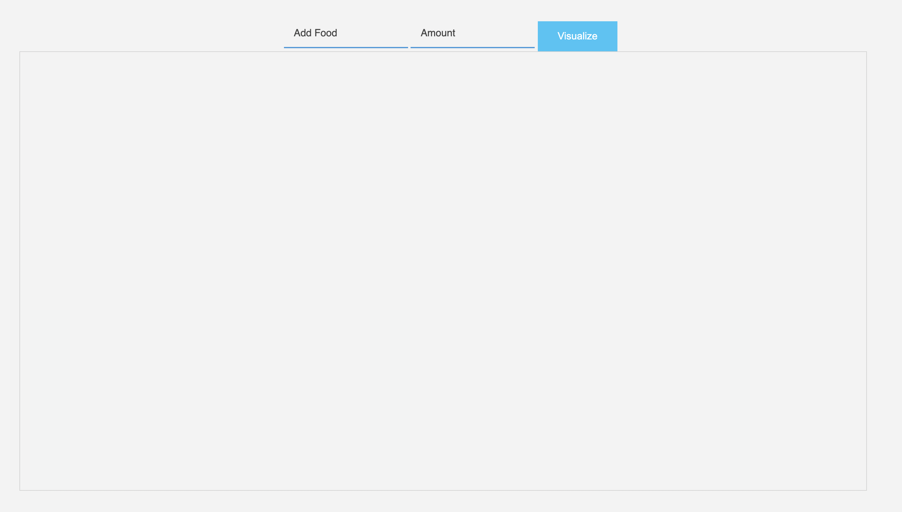
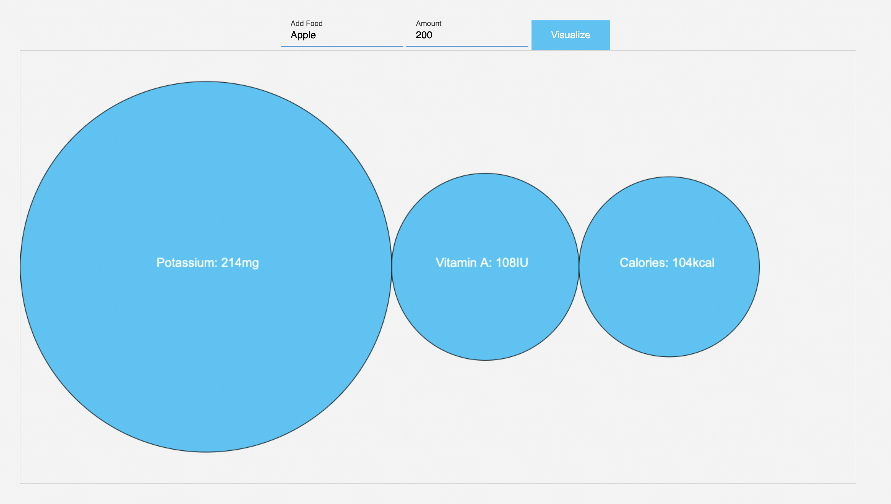

# Nutrition Visualization

Provides a data visualization of the nutrients of any food

## Purpose:

This application was created as a quick way for users to view the nutrition facts of
a specific food quickly and easily. Here users can quickly note down the nutrition facts
of the foods they eat and plan their diet accordingly. This application can take in the
input of almost any food given any quantity.

## Reason

I have always wanted to track my macros and the number of calories I am eating everday,
however it becomes tedious when I repeatedly have to google search the food I am eating
and find websites that have the correct data. Which is why I created this application to
solve this issue. Here on one site I can quickly enter any food I want and right away get
the correct data in a visual style.

## How it works:

This application was coded purely using JavaScript. It utilized the Spoonacular Food
API data server to get data on the various foods. To find more information of this API
see https://spoonacular.com/food-api.

## Screenshots:

